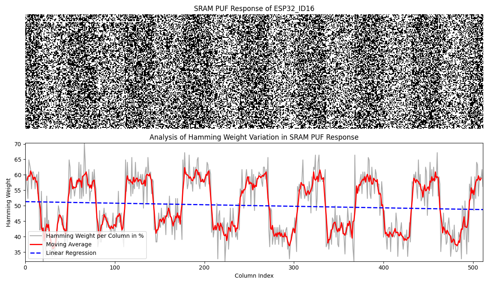

# ESP32 SRAM PUF Authentication

**Hardware-based authentication using Physical Unclonable Functions (PUF) in ESP32 RTC SLOW Memory**

[](https://opensource.org/licenses/MIT)
[]()
[]()
[]()

---

## What is This?

This project demonstrates **hardware-based device authentication** using SRAM Physical Unclonable Functions (PUFs) on ESP32 microcontrollers. Each chip has unique manufacturing variations at the atomic level that create a distinct "fingerprint" in its SRAM memory when powered on. This fingerprint can be used to generate authentication tokens **without storing any credentials on the device**.

**This is a Proof-of-Concept for learning and experimentation.** Use it to understand how PUF-based authentication works, run your own experiments, or as inspiration for implementing PUF authentication in your own projects.

---

## What Makes This Different?

**Most research papers implement complex cryptographic protocols that require specialized server software.** This project takes a different approach:

- **API token generation** - Generates authentication tokens that work with standard protocols (HTTP, MQTT, CoAP, etc.)
- **No special server software** - Integrates seamlessly with existing authentication systems
- **No stored credentials** - Tokens are derived from hardware characteristics at boot time
- **Bit-selection approach** - Uses naturally stable bits (no error correction codes needed)
- **Simple & accessible** - This PoC demonstrates the concept using HTTP as an example

Traditional IoT authentication stores credentials in non-volatile memory. If a device is compromised, those credentials can be extracted. SRAM PUF avoids this - the authentication token is derived from physical hardware characteristics on each boot and never permanently stored.

---

## 🚀 Quick Start

**Want to try it?** See [QUICK_START.md](QUICK_START.md) for step-by-step instructions (30 minutes).

**Quick overview:**
1. Start servers (Docker or Node.js)
2. Collect SRAM measurements from ESP32 (power cycle at least 30 times)
3. Generate PUF challenge and API token
4. Configure and test authentication

---

## Research Foundation

Based on the Master's thesis ["Long-Term Assessment of SRAM Physical Unclonable Functions on the ESP32"](https://phaidra-ui.fhstp.ac.at/detail/o:5828) by Christian Lepuschitz (2024), St. Pölten University of Applied Sciences.

**Before implementing this authentication system, extensive research was conducted to understand SRAM PUF behavior and validate the bit-selection approach.**

### Research Scope

- **16 ESP32 microcontrollers** tested (7 WROOM-32, 7 WROVER-B, 2 ESP32-S)
- **44,778 power cycles** over 6 months
- **Temperature testing** at -20°C and room temperature
- **Voltage testing** across 2.8V - 7V range

### Key Findings

| Metric | Result |
|--------|--------|
| Bit Stability | ~94% at constant temperature |
| Inter-Device Uniqueness | ~50% Hamming distance |
| Randomness | ~50% Hamming weight (balanced 0/1) |
| Temperature Impact | ~10% deviation at -20°C |
| Long-term Drift | 5.5% → 6.2% over 6 months |

**Research Impact:** These 44,778 measurements across 16 devices confirmed that ~94% of bits remain stable across power cycles, validating the bit-selection approach used in this authentication system. The research also identified temperature sensitivity and long-term drift patterns that informed the design decisions in this PoC.

**Authentication reliability:** Due to the ~94% bit stability, authentication attempts can occasionally fail if unstable bits flip. Collecting more measurements under varying conditions (different temperatures, power supplies, time intervals) improves stable bit identification and increases authentication reliability. Minimum 30 measurements recommended for reliable authentication; more is better. The thesis validated stable bit selection with 100+ measurements.

For complete analysis and methodology, see the [thesis](https://phaidra-ui.fhstp.ac.at/detail/o:5828).

---

## Research Methodology & Visual Analysis

### SRAM Memory Characterization

**Complete 8KB RTC SLOW Memory visualization showing power-on state of each bit**

8KB SRAM visualization where each pixel represents one bit (white = logic 1, black = logic 0). The visualization shows Hamming weight distribution across all 8192 bits, demonstrating balanced distribution with approximately 50% ones and zeros.


**Bit pattern analysis revealing non-uniform bit distributions in ESP32 devices**

Analysis revealing biased bits in certain ESP32 devices. Some bits show preference for one state over the other (60% vs 40% probability), deviating from ideal 50% randomness. This could potentially impact security if attackers identify these predictable bit positions.



### Device Uniqueness Validation

**Hamming distance comparison between all 16 tested ESP32 microcontrollers**

This table shows the Hamming distance (bit differences) between each pair of ESP32 devices from a single measurement. The values consistently cluster around 50%, demonstrating that each device produces a unique SRAM pattern that is significantly different from all other devices. This validates the uniqueness requirement for PUF-based authentication.


### Long-term Stability Analysis

**Bit stability analysis across thousands of power cycles**

Hamming distance progression showing bit changes relative to the first measurement. After approximately 6000 power cycles, about 6% of bits differ from the initial state, indicating gradual drift over time.


**Rolling Hamming distance measuring immediate bit flip patterns**

Rolling Hamming distance measuring changes between consecutive measurements rather than against the initial state. This approach reveals immediate bit flip patterns and short-term stability characteristics of the SRAM PUF.


**Visual Analysis Impact:** These visualizations show representative samples from the 44,778 measurements across 16 ESP32 devices. While the specific images display data from individual ESP32s, the patterns and characteristics shown here are representative of all tested microcontrollers. The bit stability patterns, temperature effects, and long-term drift characteristics demonstrated across all devices validate the bit-selection approach used in this PoC.

---

## Authentication System Implementation

**Based on the research findings above, this PoC implements a practical authentication system using the validated bit-selection approach.**

### Physical Basis

SRAM cells have microscopic manufacturing variations that cause each cell to prefer 0 or 1 at power-on.

```
Manufacturing Variations → Cell Preferences → Unique Pattern → Device Fingerprint
```

### Authentication Flow

**Enrollment:**
Power cycle 30+× → Identify stable bits → Generate API token → Store on server

**Authentication:**
Power on → Read SRAM → Extract stable bits → Derive token → Server validates

### Approach

This implementation generates **authentication tokens** that work with standard IoT protocols:
1. Collect multiple measurements to identify stable bits
2. Extract stable bits from SRAM (>94% unchanged)
3. Derive authentication token using PBKDF2 (not using raw bits directly)

**Why PBKDF2?** Using raw SRAM bits directly would expose the PUF response. PBKDF2 (Password-Based Key Derivation Function) creates a one-way transformation - even if an attacker intercepts the token, they cannot reverse it to get the original SRAM pattern. Additionally, PBKDF2 allows generating multiple different tokens from the same PUF by using different salts or parameters.

**Why this matters:** The token can be used with any protocol that supports authentication tokens - HTTP, MQTT, CoAP, WebSocket, etc. Most research papers implement complex cryptographic protocols that require specialized server software. This approach generates standard tokens that integrate with existing authentication systems.

This PoC uses HTTP as a simple example, but the same token generation works with other IoT protocols.

---

## Repository Contents

**This repository provides a complete implementation for testing and experimentation:**

**Hardware:** 3 ESP32 Arduino sketches (reader, uploader, authenticator)  
**Server:** Node.js auth + measurement servers with Docker support  
**Tools:** Python scripts for challenge generation and PUF analysis  

See [STRUCTURE.md](STRUCTURE.md) for complete repository layout.

---

## Technical Summary

**Memory:** RTC SLOW Memory (8 KB at 0x50000000)  
**Stability:** ~94% across power cycles  
**Uniqueness:** ~50% Hamming distance between devices  
**Key Derivation:** PBKDF2-HMAC-SHA256 (10,000 iterations)  
**Salt:** `"ESP32-SRAM-PUF-Auth-v1"`

**Why bit-selection?** Error correction can reduce security. Using only stable bits avoids this issue.

---

## Citation

```bibtex
@mastersthesis{lepuschitz2024sram,
  author = {Christian Lepuschitz},
  title = {Long-Term Assessment of SRAM Physical Unclonable Functions on the ESP32: Analysing RTC SLOW Memory for Building Secure IoT Authentication Systems},
  school = {St. P{\"o}lten University of Applied Sciences},
  year = {2024},
  url = {https://phaidra-ui.fhstp.ac.at/detail/o:5828}
}
```

---

## License

MIT License - Free to use, modify, and distribute. See [LICENSE](LICENSE) for details.